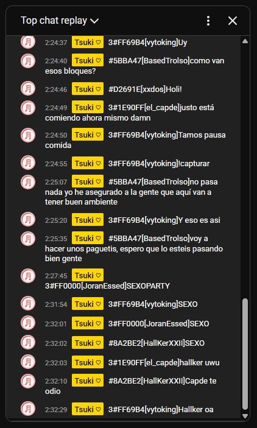
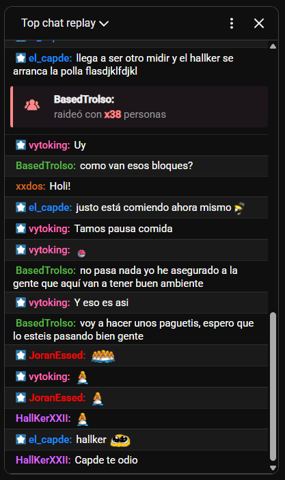

# TsukiChat

> **Extensión que traduce mensajes del chat de YouTube Live y los adapta a un formato similar al de Twitch.**

El objetivo que busco con esta extensión es poder resubir los Chats de Twitch a YouTube ya que Twitch puso límite a la cantidad de VODs que puedes tener. Resubir el directo es algo que suele hacer todo el mundo pero no hay forma de resubir el chat de forma limpia más allá de mostrarlo en pantalla. Con esta extensión puedes traducir mensajes con un formato en concreto para simular ese chat resubido.

---

## 🖼️ Comparación Visual

<div align="center">

| **Sin TsukiChat** | **Con TsukiChat** |
|:---:|:---:|
|  |  |
| *Chat básico de YouTube* | *Chat estilo Twitch con badges y formato* |

</div>

---

## Instalación

### Chrome/Edge/Opera..
[](https://chromewebstore.google.com/detail/tsukichat/dojcelbefjhbapbhgkplifhcfblpgaab)

### Firefox  
[](https://chromewebstore.google.com/detail/tsukichat/dojcelbefjhbapbhgkplifhcfblpgaab)

## Uso

### Aplicación para clonar los mensajes

Usa cualquier aplicación que pueda leer mensajes de Twitch y enviar mensajes a YouTube:

- **[SAMMI.solutions](https://sammi.solutions/)** *(os dejo el Deck ya hecho en los archivos del proyecto para que podáis importarlo)*

- **[Streamer.bot](https://streamer.bot/)** *(tenéis que hacerlo vosotros, pero es sencillo seguro que podéis ❤️)*

### Formato de mensaje

Con alguna de esas aplicaciones debes obtener la información del mensaje recibido de Twitch y clonarlo a YouTube con este formato:

```
BADGES#COLOR[USERNAME]MESSAGE
```
**Ejemplo:** `0#FF5733[TsukiSoft]¡Hola mundo!`

#### Badges disponibles:
| Badge | Tipo |
|:---:|:---|
| `0` | Streamer |
| `1` | VIP |
| `2` | Moderador |
| `3` | Suscriptor |

---

### Formato de eventos

Para eventos más de lo mismo, obtén la información del evento recibido en Twitch y clónalo a YouTube de esta forma:

```
PREFIJO_[USERNAME][DATA]
```
**Ejemplo:** `sub_[TsukiSoft]se acaba de suscribir x23 meses!`

#### Prefijos disponibles:
| Prefijo | Evento |
|:---:|:---|
| `sub` | Suscripción |
| `bit` | Bits/Cheers |
| `raid` | Raid |
| `gifted` | Subs regaladas |
| `kofi` | Donaciones |

## Configuración

En el popup puedes activar/desactivar:

| Función | Descripción |
|:---:|:---|
| **Modo oscuro/claro** |
| **Fondos alternados** |
| **Líneas divisorias** |
| **Ajuste de colores** |
| **Tamaño de fuente** |
| **Timestamps** |
| **Badges individuales** |
| **Emotes 7TV** |